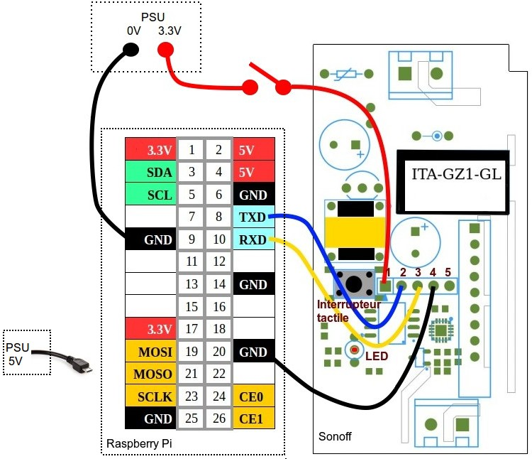

# Raspberry
My own All In One Raspberry Pi project.
## Brightness LCD Screen (0-255)
    sudo su
    echo 32 > /sys/class/backlight/rpi_backlight/brightness
## Weather forecast
    sudo apt-get install libxml2-utils inkscape
    sudo chmod +x /var/www/html/forecast.php
## Controller state
    sudo chmod +x /usr/sbin/PindaNetState.sh
    sudo systemctl daemon-reload
    sudo systemctl enable PindaNetState.timer
    sudo systemctl start PindaNetState.timer
    systemctl list-timers
## Bluetooth Detection (moved to Alarm Raspberry Pi)
### Bluetooth SmartPhone or Nokia Steel Watch
    sudo chmod +x /usr/sbin/bluetoothscan.sh
    sudo systemctl daemon-reload
    sudo systemctl enable PindaNetBluetoothScan.timer
    sudo systemctl start PindaNetBluetoothScan.timer
    systemctl list-timers
### Bluetooth GSM (old version)
    hcitool scan
    echo -n "MA:C-:ad:dr:es:s0" > bluetooth.detection
    sudo hcitool info MA:C-:ad:dr:es:s0 | md5sum | awk '{ print $1 }' >> bluetooth.detection
    sudo mv bluetooth.detection /var/www/html/data/
    sudo chmod +x /usr/sbin/bluetooth-detection.sh
    sudo systemctl daemon-reload
    sudo systemctl enable PindaNetBluetoothDetection.timer
    sudo systemctl start PindaNetBluetoothDetection.timer
    systemctl list-timers
## Motion Detection
    sudo mkdir -p /var/www/html/motion/fotos
script included in /usr/sbin/bluetooth-detection.sh
## Bluetooth speakers
    nano .asoundrc
    
    pcm.!default {
        type plug
        slave.pcm {
                type bluealsa
                device "F8:DF:15:A5:CD:CC"
                profile "a2dp"
        }
    }

    ctl.!default {
        type bluealsa
    }
## Radio
    alsamixer # set volume
    sudo apt-get install mpd mpc
    sudo nano /etc/mpd.conf
    
    restore_paused "yes"

<pre>audio_output {
        type            "alsa"
        name            "My ALSA Device"
#       device          "hw:0,0"        # optional
#       mixer_type      "hardware"      # optional
        mixer_type      "software"      # optional
#       mixer_device    "default"       # optional
#       mixer_control   "PCM"           # optional
#       mixer_index     "0"             # optional
}</pre>
For paired Bluetooth speaker DEV=MAC-address
<pre>audio_output {
        type            "alsa"
        name            "My ALSA Device"
        device          "bluealsa:HCI=hci0,DEV=F8:DF:15:A5:CD:CC,PROFILE=a2dp"
#       device          "hw:0,0"        # optional
        mixer_type      "software"      # optional
#       mixer_device    "default"       # optional
#       mixer_control   "PCM"           # optional
#       mixer_index     "0"             # optional
}</pre>
    sudo systemctl restart mpd.service
    mpc add http://icecast.vrtcdn.be/radio1-high.mp3
    mpc add http://icecast.vrtcdn.be/ra2wvl-high.mp3
    mpc add http://icecast.vrtcdn.be/klara-high.mp3
    mpc add http://icecast.vrtcdn.be/klaracontinuo-high.mp3
    mpc add http://icecast.vrtcdn.be/stubru-high.mp3
    mpc add http://icecast.vrtcdn.be/mnm-high.mp3
    mpc add http://icecast.vrtcdn.be/mnm_hits-high.mp3
    mpc add http://progressive-audio.lwc.vrtcdn.be/content/fixed/11_11niws-snip_hi.mp3 
    mpc add http://icecast.vrtcdn.be/ketnetradio-high.mp3
    mpc add http://streams.crooze.fm:8000
    mpc add http://stream.vbro.be:9100/vbro
    mpc add http://icecast-qmusic.cdp.triple-it.nl/JOEfm_be_live_128.mp3
    mpc add http://icecast-qmusic.cdp.triple-it.nl/Qmusic_be_live_128.mp3
    mpc play 1
    mpc volume 100
    mpc stop
    mpc play 2
    mpc stop    
    sudo chmod +x /var/www/html/mpc.sh
## Software Access Point
    sudo apt-get install hostapd bridge-utils
    sudo nano /etc/hostapd.conf
<pre># 802.11n Access Point
interface=wlan0
driver=nl80211
channel=6
ssid=SoftAP
#ignore_broadcast_ssid=1
hw_mode=g
auth_algs=1
# Wireless Multimedia Extension/Wi-Fi Multimedia needed for
# IEEE 802.11n (HT)
wmm_enabled=1
# 1 to enable 802.11n
ieee80211n=1
ht_capab=[HT20][SHORT-GI-20][DSSS_CK-HT40]

# WEP/WPA/WPA2 bitmask, 0 for open/WEP, 1 for WPA, 2 for WPA2
wpa=2

# WPA2 settings
wpa_passphrase=snt+-456
wpa_key_mgmt=WPA-PSK
wpa_pairwise=TKIP CCMP
rsn_pairwise=CCMP

bridge=br0</pre>

<pre># 802.11ac Access Point
interface=wlan0
#ctrl_interface=/var/run/hostapd
#ctrl_interface_group=0
driver=nl80211
channel=36

#macaddr_acl=0

#deny_mac_file=/etc/hostapd/hostapd.deny

wmm_enabled=1         # QoS support
obss_interval=300

ht_capab=[HT40+][SHORT-GI-20][DSSS_CCK-40]

ieee80211ac=1         # 802.11ac support
vht_oper_chwidth=0
vht_capab=[SHORT-GI-80][SU-BEAMFORMEE]

beacon_int=50
dtim_period=20

basic_rates=180 240 360 480 540

disassoc_low_ack=0

ssid=SoftAP-5.0
bridge=br0
hw_mode=a
auth_algs=1
#ignore_broadcast_ssid=0
wpa=2
wpa_passphrase=snt+-456
wpa_key_mgmt=WPA-PSK
rsn_pairwise=CCMP</pre>
    sudo nano /etc/default/hostapd
<pre>DAEMON_CONF="/etc/hostapd.conf"</pre>

    sudo nano /etc/network/interfaces
<pre># interfaces(5) file used by ifup(8) and ifdown(8)

# Please note that this file is written to be used with dhcpcd
# For static IP, consult /etc/dhcpcd.conf and 'man dhcpcd.conf'

# Include files from /etc/network/interfaces.d:
source-directory /etc/network/interfaces.d

# Create a bridge with dynamic IP
auto br0
iface br0 inet dhcp
        bridge_ports eth0</pre>

### Enable ip_forward
    sudo nano /etc/sysctl.conf    
<pre>net.ipv4.ip_forward=1</pre>
    sudo systemctl disable hostapd.service 
    sudo systemctl stop hostapd.service
## YouTube Live Video Stream
    # Account pictogram > Creator Studio > Live Streaming
    # Werkt ook voor Facebook Live Video
<!---    sudo apt-get install libmp3lame-dev libx264-dev
    mkdir software
    cd software
    wget http://ffmpeg.org/releases/ffmpeg-3.1.4.tar.bz2
    cd ..
    mkdir src
    cd src/
    tar xvjf ../software/ffmpeg-3.1.4.tar.bz2
    cd ffmpeg-3.1.4/
    ./configure --enable-gpl --enable-nonfree --enable-libx264 --enable-libmp3lame
    make
    sudo make install
    sudo /sbin/ldconfig

    wget https://johnvansickle.com/ffmpeg/releases/ffmpeg-release-armhf-32bit-static.tar.xz
    tar -xvf ffmpeg-release-armhf-32bit-static.tar.xz
--> 
    libcamera-vid -o - -t 0 -n --width 1280 --height 720 --framerate 25 --bitrate 6000000 | ffmpeg -re -ar 44100 -ac 2 -acodec pcm_s16le -f s16le -ac 2 -i /dev/zero -f h264 -i - -vcodec copy -acodec aac -ab 128k -g 50 -strict experimental -f flv rtmp://a.rtmp.youtube.com/live2/<SESSIE>
    sudo apt-get install ffmpeg
    raspivid -o - -t 0 -fps 25 -b 6000000 -w 1280 -h 720 | ffmpeg -re -ar 44100 -ac 2 -acodec pcm_s16le -f s16le -ac 2 -i /dev/zero -f h264 -i - -vcodec copy -acodec aac -ab 128k -g 50 -strict experimental -f flv rtmp://a.rtmp.youtube.com/live2/<SESSIE>
    
### Audio recorder
    arecord --device=hw:3,0 --format S16_LE --rate 44100 -V mono -c1 sample.wav
    
### FFMPEG video recorder
    # Capture to an image file, continually overwriting it with new contents
    # https://stegard.net/2021/07/capture-images-from-a-webcam-using-ffmpeg/
    v4l2-ctl --list-device
    ffmpeg -y -f v4l2 -video_size 1280x720 -i /dev/video1 -r 0.2 -qscale:v 2 -update 1 /tmp/webcam.jpg
    # https://wiki.archlinux.org/title/FFmpeg#Recording_webcam
    ffmpeg -f v4l2 -video_size 640x480 -i /dev/video1 -c:v libx264 -preset ultrafast webcam.mp4
    ffmpeg -f v4l2 -video_size 640x480 -i /dev/video1 -f alsa -i default -c:v libx264 -preset ultrafast -c:a aac webcam.mp4

## Bluetooth OBEX Push file transfer
### Bluetooth Raspberry Pi Receiver
    sudo apt install obexpushd -y
    sudo sed -i /etc/systemd/system/dbus-org.bluez.service -e "s/^ExecStart=\/usr\/lib\/bluetooth\/bluetoothd.*/ExecStart=\/usr\/lib\/bluetooth\/bluetoothd -C/"
    sudo systemctl daemon-reload
    sudo systemctl restart bluetooth.service

    sudo mkdir -p /var/www/html/data/bluetooth

    cat > obexpush.service <<EOF
    [Unit]
    Description=OBEX Push service
    After=bluetooth.service
    Requires=bluetooth.service
    [Service]
    ExecStartPre=/bin/sleep 30
    ExecStart=/usr/bin/obexpushd -B23 -o /var/www/html/data/bluetooth -n
    [Install]
    WantedBy=multi-user.target
    EOF
    sudo mv obexpush.service /etc/systemd/system/
    sudo systemctl daemon-reload
    sudo systemctl enable obexpush.service
    sudo systemctl start obexpush.service

### Pair Bluetooth Raspberry Pi's
#### Remove previous pairings between both Raspberry Pi's.

    sudo bluetoothctl
    paired-devices
    remove MAC-address
#### Make first Raspberry Pi discoverable

    sudo bluetoothctl
    discoverable on
Do not exit bluetoothctl to follow the pairing
#### Pair second Raspberry Pi

    sudo bluetoothctl
    scan on
    agent on
    default-agent
    pair MAC-address
    trust MAC-address
    info MAC-address
    exit
#### Bluetooth Service information

    sdptool browse XX:XX:XX:XX:XX:XX
### Send file to Raspberry Pi Bluetooth receiver
    sudo obexftp --nopath --noconn --uuid none --bluetooth MAC_address --channel 23 -p /home/pi/debug.txt
You can not overwrite existing files.
#### Move received Bluetooth files with incron
    sudo apt install incron
    sudo systemctl start incron
    sudo systemctl enable incron
    echo root | sudo tee /etc/incron.allow
    sudo incrontab -e
    
    /var/www/html/data/bluetooth IN_CLOSE_WRITE /bin/mv $@/$# /var/www/html/data/$#
## Flash Tasmota on Sonoff Basic
    Based on https://tasmota.github.io/docs/Flash-Sonoff-using-Raspberry-Pi/
    Start Raspberry Pi 3
    sudo apt install python-pip
    sudo pip install esptool
    sudo systemctl stop serial-getty@ttyS0.service
    sudo systemctl disable serial-getty@ttyS0.service
    sudo cp /boot/cmdline.txt /boot/cmdline.bak
    sudo nano /boot/cmdline.txt
    Remove "console=serial0,115200"
    sudo nano /boot/config.txt
    Add enable_uart=1
    Add dtoverlay=pi3-miniuart-bt
    Add dtoverlay=pi3-disable-bt
    Shutdown and Power off Raspberry Pi
    
    Open Sonoff Basic and solder connections (see: https://www.sigmdel.ca/michel/ha/sonoff/flashing_sonoff_en.html with PSU)

    
    Start Raspberry Pi
    wget http://ota.tasmota.com/tasmota/release/tasmota.bin
    
    Start Sonoff while holding the button for 10 seconds to start in flashing mode
    esptool.py --port /dev/ttyAMA0 read_flash 0x00000 0x100000 Sonoff_backup_01.bin
    Restart Sonoff while holding the button for 10 seconds to start in flashing mode
    esptool.py --port /dev/ttyAMA0 erase_flash
    Start Sonoff while holding the button for 10 seconds to start in flashing mode
    esptool.py --port /dev/ttyAMA0 write_flash -fm dout 0x0 tasmota.bin
    
    Shutdown and Power off Raspberry Pi
    Power off Sonoff
    Connect Sonoff to 220 V AC
    
    Scan for tasmota_XXXXXX-XXXX Wifi Acces Point
    Connect to tasmota_XXXXXX-XXXX
    Surf to http://192.168.4.1
    Configure Sonoff Wifi
    Save configuration, Sonoff will reboot and connect to your home AP
    
### Get latest version
    curl -s https://api.github.com/repos/arendst/Tasmota/releases/latest | grep -oP '"tag_name": "\K(.*)(?=")' | cut -d$'v' -f 2
    wget -qO- http://tasmota_8be4af-1199/cm?cmnd=Status%202 | python -c 'import sys, json; print(json.load(sys.stdin)["StatusFWR"]["Version"])' | cut -d$'(' -f 1
## HifiBerry miniAmp
    https://www.hifiberry.com/docs/data-sheets/datasheet-miniamp/

    https://www.hifiberry.com/docs/software/configuring-linux-3-18-x/
    sudo nano /boot/config.txt
        disable
            #dtparam=audio=on
        add
            dtoverlay=hifiberry-dac
    nano ~/.asoundrc #Software Volume adjustment
        pcm.softvol {
            type            softvol
            slave {
                pcm         "default"
            }
            control {
                name        "SoftMaster"
                card        0
            }
        }
    speaker-test -Dsoftvol -c2 -twav
    alsamixer

    # https://www.raspberrypi.org/forums/viewtopic.php?t=235519
    sudo apt-get install pulseaudio pulseaudio-module-bluetooth
    sudo usermod -a -G bluetooth pi
    sudo reboot
    sudo nano /etc/bluetooth/main.conf
        Class = 0x240414
        DiscoverableTimeout = 0
    sudo systemctl restart bluetooth
    bluetoothctl
        power on
        discoverable on
        pairable on
        agent on
    # starten na bluetooth
    pulseaudio --start
    sudo systemctl status bluetooth
    sudo journalctl -f -u bluetooth.service
    bluetoothctl
        scan on
        pair XX:XX:XX:XX:XX:XX
        trust XX:XX:XX:XX:XX:XX
        connect XX:XX:XX:XX:XX:XX
    # To be continued
## IQaudio DigiAMP+
    # https://datasheets.raspberrypi.org/iqaudio/iqaudio-product-brief.pdf
    sudo nano /boot/config.txt
        disable
            #dtparam=audio=on
        add
            dtoverlay=iqaudio-dacplus,auto_mute_amp
    alsamixer
    speaker-test -c2 -twav
    # https://www.raspberrypi.org/forums/viewtopic.php?t=247892
    sudo apt install bluealsa
    sudo nano -B -P /lib/systemd/system/bluealsa.service
        ExecStart=/usr/bin/bluealsa --profile=a2dp-sink
    
    sudo nano /etc/systemd/system/aplay.service
    [Unit]
    Description=BlueALSA aplay service
    After=bluetooth.service
    Requires=bluetooth.service

    [Service]
    ExecStart=/usr/bin/bluealsa-aplay 00:00:00:00:00:00 --pcm-buffer-time=10000

    [Install]
    WantedBy=multi-user.target
    
    sudo systemctl enable aplay
    sudo usermod -a -G bluetooth pi
    sudo nano /etc/bluetooth/main.conf
        Class = 0x240414
    sudo shutdown -r now
    bluetoothctl
        scan on
        pair XX:XX:XX:XX:XX:XX
        trust XX:XX:XX:XX:XX:XX
        connect XX:XX:XX:XX:XX:XX
## Audio streaming
### Compile and install on openSUSE Leap 15.2 x64 system
    #https://gavv.github.io/articles/roc-tutorial/
    sudo zypper install gcc-c++ pkg-config scons ragel gengetopt libuv-devel libunwind-devel libpulse-devel sox-devel libtool intltool autoconf automake make cmake git
    #sudo zypper addrepo https://download.opensuse.org/repositories/#home:malcolmlewis:TESTING/openSUSE_Leap_15.2/#home:malcolmlewis:TESTING.repo
    #sudo zypper refresh
    #sudo zypper install cpputest-devel
    git clone https://github.com/roc-streaming/roc-toolkit.git
    cd roc-toolkit
    scons -Q --build-3rdparty=openfec --disable-tests --disable-pulseaudio
    sudo scons -Q --build-3rdparty=openfec --disable-tests --disable-pulseaudio install
    sudo modprobe snd-aloop
    # Test
    roc-recv -vv -s rtp+rs8m::10001 -r rs8m::10002 -d alsa -o 'plughw:CARD=PCH,DEV=0'
    # Play some audio through virtual audio device
    roc-send -vv -s rtp+rs8m:127.0.0.1:10001 -r rs8m:127.0.0.1:10002 -d alsa -i 'plughw:CARD=Loopback,DEV=1'
#### Crosscompile for Raspberry Pi on openSUSE Leap 15.2 x64 system
    sudo zypper install docker
    sudo systemctl start docker.service
    cd
    # sourcecode in new directory
    rm -r -f roc-toolkit
    git clone https://github.com/roc-streaming/roc-toolkit.git
    cd roc-toolkit
    sudo docker run -t --rm -u "${UID}" -v "${PWD}:${PWD}" -w "${PWD}"     rocproject/cross-arm-linux-gnueabihf       scons -Q         --disable-pulseaudio         --disable-tests         --host=arm-linux-gnueabihf         --build-3rdparty=libuv,libunwind,openfec,alsa,sox
    scp ./bin/arm-linux-gnueabihf/roc-{recv,send} pindadomo:
#### Decrease latency to synchronise sound with video
    #https://github.com/roc-streaming/roc-toolkit/discussions/255
    ./roc-recv -vv -s rtp+rs8m::10001 -r rs8m::10002 -d alsa -o 'plughw:CARD=IQaudIODAC,DEV=0' --frame-size=320 --sess-latency=25ms
    roc-send -vv -s rtp+rs8m:192.168.1.38:10001 -r rs8m:192.168.1.38:10002 -d alsa -i 'plughw:CARD=Loopback,DEV=1' --nbsrc=5 --nbrpr=5 --frame-size=320
