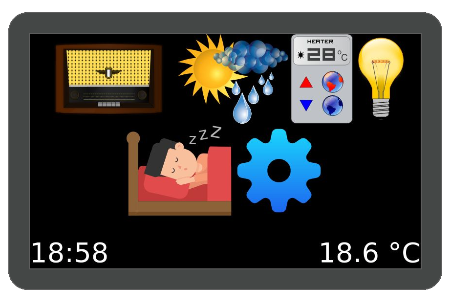
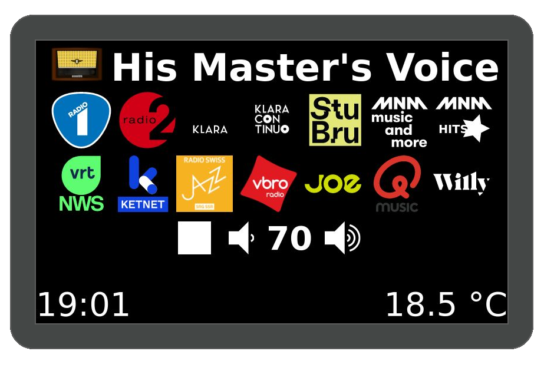
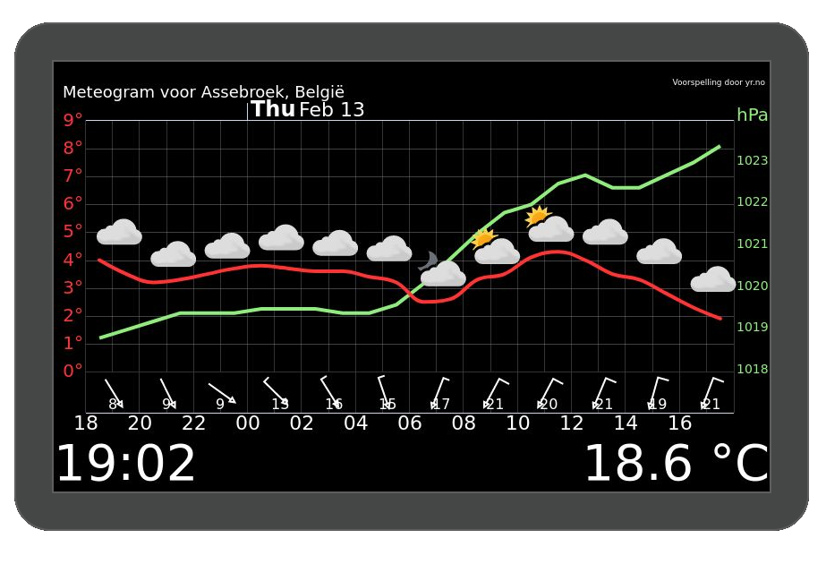
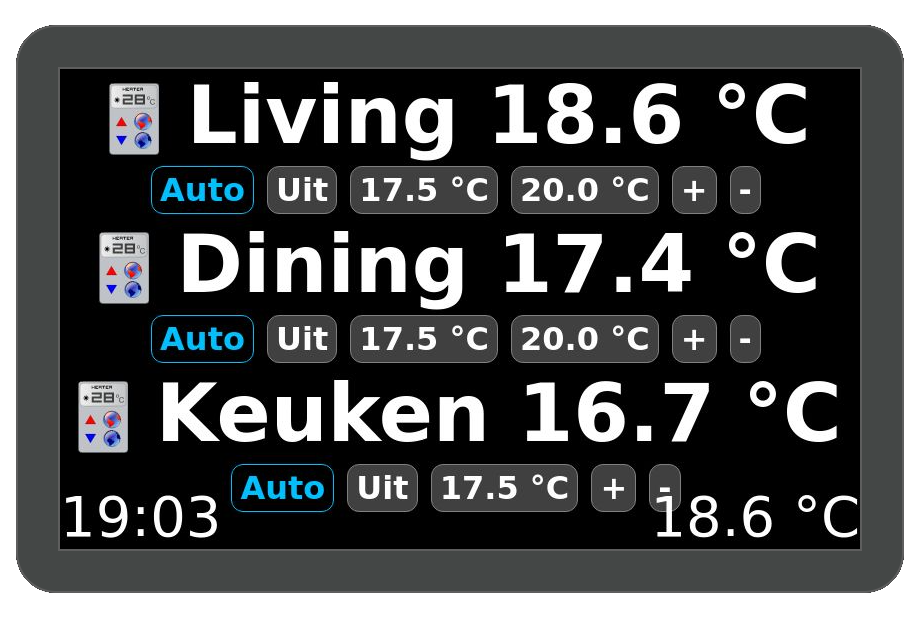
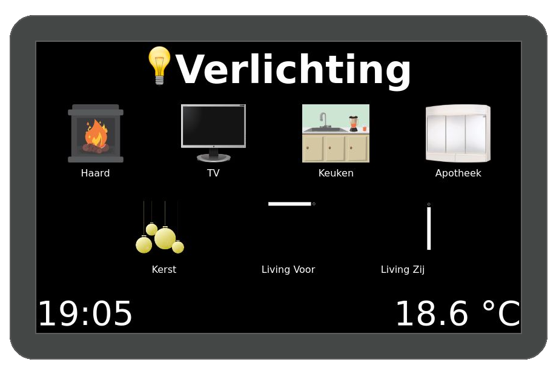
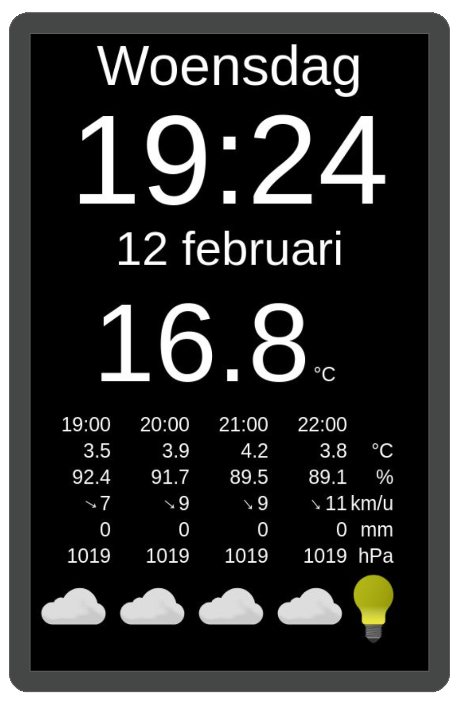

# My own Domotica Raspberry Pi project.
## Alarmclock
Alarmclock with 7 inch screen, mimiAmp stereo amplifier and Tempeature sensor.
The screen dims at night.

## Dining
Movie frame for HDMI screen with Temperature sensor

## DomoticaController
### Central Domotica Controller with 7 inch Touchscreen
- Clock
  
- Menu
  
- Radio with IQaudio DigiAMP+ amplifier
  
- Weather forecast
  
- Thermostat (switching infrared panels with Tasmota)
  
- Light controller (Tasmota)
  
- Configuration with JSON file
## DomoticaSlave
Temperature sensor with Weather Forecast and IR sensor

