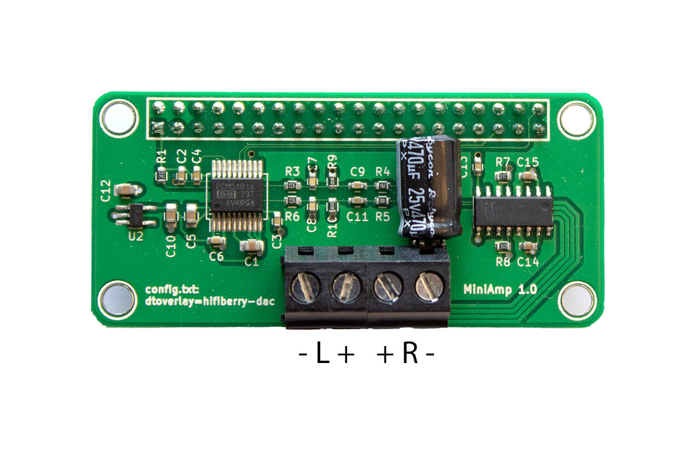

# Raspberry
My own All In One Raspberry Pi project.
## Brightness LCD Screen (0-255)
    sudo su
    echo 32 > /sys/class/backlight/rpi_backlight/brightness
## Flash Tasmota on Sonoff Basic
Based on [https://github.com/tasmota/docs-7.1/blob/master/Flash-Sonoff-using-Raspberry-Pi.md](https://github.com/tasmota/docs-7.1/blob/master/Flash-Sonoff-using-Raspberry-Pi.md)

    https://github.com/tasmota/docs-7.1/blob/master/Flash-Sonoff-using-Raspberry-Pi.md
    Start Raspberry Pi 3
    sudo apt install python-pip
    sudo pip install esptool
    sudo systemctl stop serial-getty@ttyS0.service
    sudo systemctl disable serial-getty@ttyS0.service
    sudo cp /boot/cmdline.txt /boot/cmdline.bak
    sudo nano /boot/cmdline.txt
    Remove "console=serial0,115200"
    sudo nano /boot/config.txt
    Add enable_uart=1
    Add dtoverlay=pi3-miniuart-bt
    Add dtoverlay=pi3-disable-bt
    Shutdown and Power off Raspberry Pi
    
Open Sonoff Basic and solder connections (see: [https://www.sigmdel.ca/michel/ha/sonoff/flashing_sonoff_en.html](https://www.sigmdel.ca/michel/ha/sonoff/flashing_sonoff_en.html) with PSU)

    
    Start Raspberry Pi
    wget http://ota.tasmota.com/tasmota/release/tasmota.bin
    
    Start Sonoff while holding the button for 10 seconds to start in flashing mode
    esptool.py --port /dev/ttyAMA0 read_flash 0x00000 0x100000 Sonoff_backup_01.bin
    Restart Sonoff while holding the button for 10 seconds to start in flashing mode
    esptool.py --port /dev/ttyAMA0 erase_flash
    Start Sonoff while holding the button for 10 seconds to start in flashing mode
    esptool.py --port /dev/ttyAMA0 write_flash -fm dout 0x0 tasmota.bin
    
    Shutdown and Power off Raspberry Pi
    Power off Sonoff
    Connect Sonoff to 220 V AC
    
    Scan for tasmota_XXXXXX-XXXX Wifi Acces Point
    Connect to tasmota_XXXXXX-XXXX
    Surf to http://192.168.4.1
    Configure Sonoff Wifi
    Save configuration, Sonoff will reboot and connect to your home AP
    
## HifiBerry miniAmp
    https://www.hifiberry.com/docs/data-sheets/datasheet-miniamp/

    https://www.hifiberry.com/docs/software/configuring-linux-3-18-x/
## IQaudio DigiAMP+
    # https://www.raspberrypi.com/documentation/accessories/audio.html
## Audio streaming
    # https://linux.pindanet.be/faq/tips24/netwerkaudio.html
