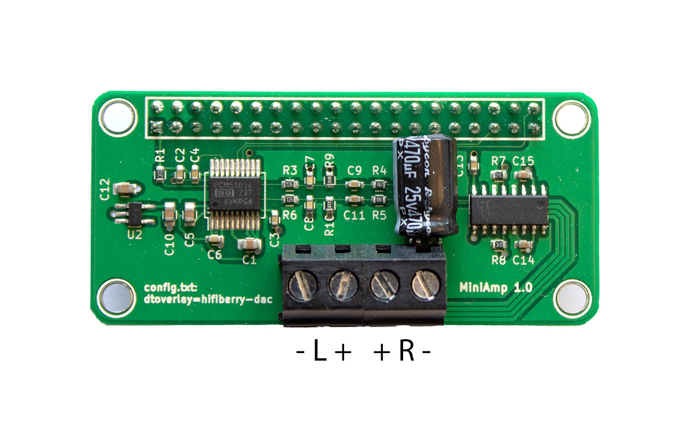

## HifiBerry miniAmp
[https://www.hifiberry.com/docs/data-sheets/datasheet-miniamp/](https://www.hifiberry.com/docs/data-sheets/datasheet-miniamp/)

[https://www.hifiberry.com/docs/software/configuring-linux-3-18-x/](https://www.hifiberry.com/docs/software/configuring-linux-3-18-x/)
## IQaudio DigiAMP+
[https://www.raspberrypi.com/documentation/accessories/audio.html](https://www.raspberrypi.com/documentation/accessories/audio.html)
## Audio streaming
[https://linux.pindanet.be/faq/tips24/netwerkaudio.html](https://linux.pindanet.be/faq/tips24/netwerkaudio.html)
