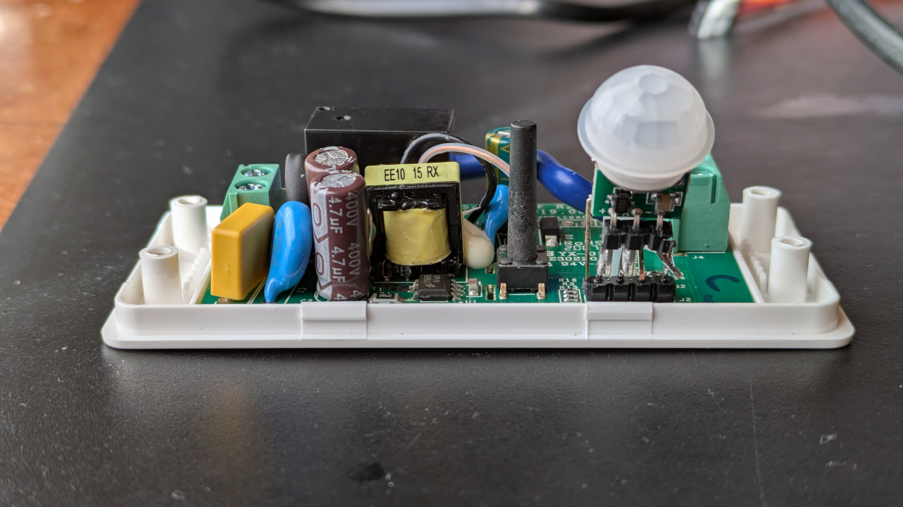
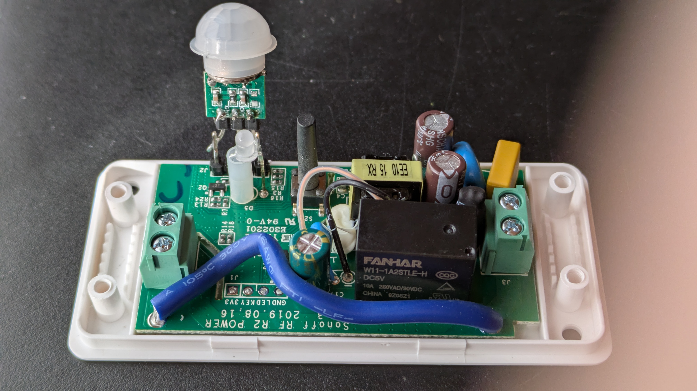

# Tasmota on Sonoff Basic R2 with AM312 PIR
## Wiring for Sonoff Basic R2 (https://tasmota.github.io/docs/Project-AM312-and-Sonoff-R2/#wiring-for-sonoff-basic-r2)

As the R2 version doesn't have GPIO14 exposed you can use GPIO3 (RX) as the AM312 data pin. GPIO2 goes high during the boot (it would toggle the switch then).

| AM312 |	ESP8255 device |
| ----- | -------------- |
| VCC |	3V3 or VCC |
| VOUT |	GPIO3 (RX) |
| GND  |	GND |

## Configuration (https://tasmota.github.io/docs/Rules/#enable-a-pir-switch-only-at-night)

Go to IP of the device, next Configuration --> Module --> set "GPIO3" to "Switch1"

Latitude and Longitude need to be set in config. Use PulseTime to specify the duration the light should remains on. PulseTime = 100 + 60 seconden (one minute) (https://tasmota.github.io/docs/Commands/#control).
Every PIR trigger will restart for that amount of time.

Go to Console

    Latitude 51.1853335
    Longitude 3.2401705
    SwitchMode1 14
    PulseTime1 160
    SwitchDebounce 261
    SetOption55 on # mDNS On

    Rule1
      ON Switch1#state=1 DO Backlog event checksunrise=%time%; event checksunset=%time% ENDON
      ON event#checksunrise<%sunrise% DO Power1 1 ENDON
      ON event#checksunset>%sunset% DO Power1 1 ENDON
    rule1 1
